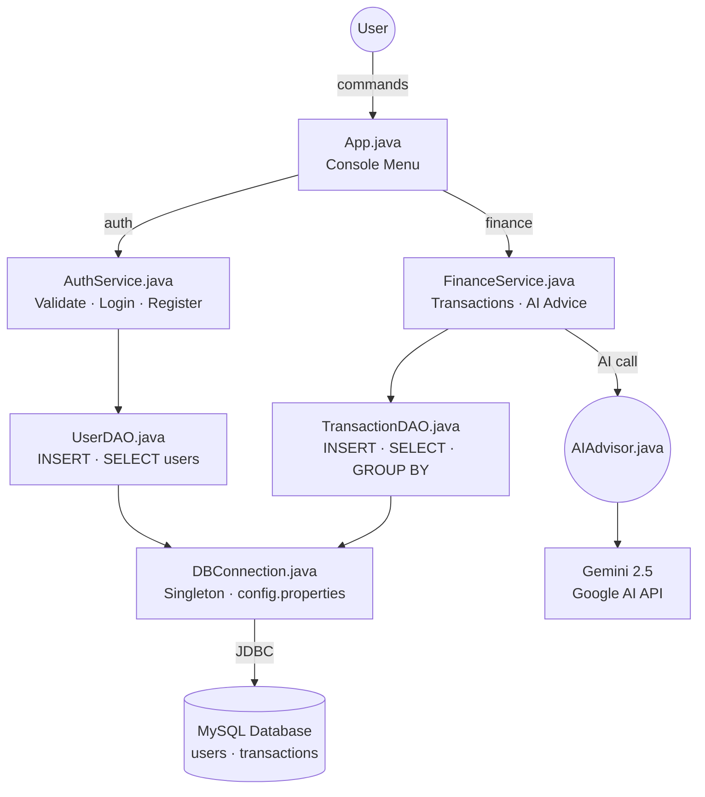

# 💰 AI-Powered Personal Finance Tracker

A console-based Java application that helps users track income and expenses, 
view financial summaries, and receive **personalized AI financial advice** 
powered by Google Gemini API.

---

## 🚀 Features

- 🔐 **Secure Authentication** — Register & login with BCrypt password hashing
- 💸 **Transaction Tracking** — Add income and expense transactions
- 📊 **Monthly Summary** — View total income vs expenses by month
- 🤖 **AI Financial Advisor** — Get personalized saving tips powered by Gemini AI
- 🗄️ **MySQL Database** — All data persisted with full JDBC integration

---

## 🛠️ Tech Stack

| Technology | Purpose |
|---|---|
| Java 21 | Core application logic |
| MySQL | Database for users & transactions |
| JDBC | Java-MySQL connectivity |
| BCrypt | Secure password hashing |
| Gemini AI API | AI-powered financial advice |
| OkHttp | HTTP client for API calls |
| Gson | JSON parsing |
| Maven | Dependency management |

---

## 🏗️ Project Architecture
```
src/main/java/com/financetracker/
│
├── App.java                    # Entry point & console menu
├── DBConnection.java           # Singleton DB connection
│
├── models/
│   ├── User.java               # User entity
│   └── Transaction.java        # Transaction entity
│
├── dao/
│   ├── UserDAO.java            # User database operations
│   └── TransactionDAO.java     # Transaction database operations
│
├── service/
│   ├── AuthService.java        # Register & login business logic
│   └── FinanceService.java     # Transaction & AI advice logic
│
└── ai/
    └── AIAdvisor.java          # Gemini API integration
```

---
## 🔄 Application Architecture

## ⚙️ Setup & Installation

### Prerequisites
- Java 21+
- MySQL 8.0+
- Maven 3.9+
- Gemini API Key (free at [aistudio.google.com](https://aistudio.google.com))

### Steps

**1. Clone the repository**
```bash
git clone https://github.com/Anshrai446/FinanceTracker.git
cd FinanceTracker
```

**2. Setup MySQL Database**
```sql
CREATE DATABASE finance_tracker;
USE finance_tracker;

CREATE TABLE users (
    id INT AUTO_INCREMENT PRIMARY KEY,
    name VARCHAR(100),
    email VARCHAR(100) UNIQUE,
    password VARCHAR(255),
    created_at TIMESTAMP DEFAULT CURRENT_TIMESTAMP
);

CREATE TABLE transactions (
    id INT AUTO_INCREMENT PRIMARY KEY,
    user_id INT,
    type ENUM('INCOME', 'EXPENSE'),
    category VARCHAR(50),
    amount DECIMAL(10,2),
    description VARCHAR(255),
    date DATE,
    FOREIGN KEY (user_id) REFERENCES users(id)
);
```

**3. Configure credentials**

Create `src/main/resources/config.properties`:
```properties
db.url=jdbc:mysql://localhost:3306/finance_tracker
db.username=root
db.password=yourpassword
gemini.api.key=your_gemini_api_key
```

**4. Build & Run**
```bash
mvn clean install
mvn exec:java -Dexec.mainClass=com.financetracker.App
```
> ⚠️ Run from **CMD** (not PowerShell) for password masking to work.

---

## 📸 Demo
```
================================
   AI Finance Tracker v1.0     
================================

1. Register
2. Login
3. Exit
Choose: 2
Email: ansh@gmail.com
Password: 

Login successful! Welcome back, Ansh!

1. Add Transaction
2. View All Transactions
3. Monthly Summary
4. AI Advisor
5. Logout
Choose: 4

🤖 Consulting AI Advisor...

💡 AI Advisor Says:
─────────────────────────────
You're doing an incredible job saving nearly all your income! 
Consider automating transfers to a dedicated savings account 
each payday. Build an emergency fund first, then explore 
index fund investments for long-term growth. Keep it up!
─────────────────────────────
```

---

## 🔒 Security Features

- Passwords hashed using **BCrypt** — never stored in plain text
- Database credentials stored in **config.properties** — gitignored
- **PreparedStatement** used everywhere — SQL injection proof

---

## 📚 Key Concepts Demonstrated

- **DAO Pattern** — Separation of database logic from business logic
- **Singleton Pattern** — Single database connection instance
- **Layered Architecture** — Model → DAO → Service → UI
- **REST API Integration** — HTTP calls to Gemini AI
- **JDBC** — Direct Java-MySQL communication

---

## 👨‍💻 Author

**Ansh Rai**  
4th Semester CS Student  
GitHub: [@Anshrai446](https://github.com/Anshrai446)

---

## 📄 License

This project is licensed under the MIT License.